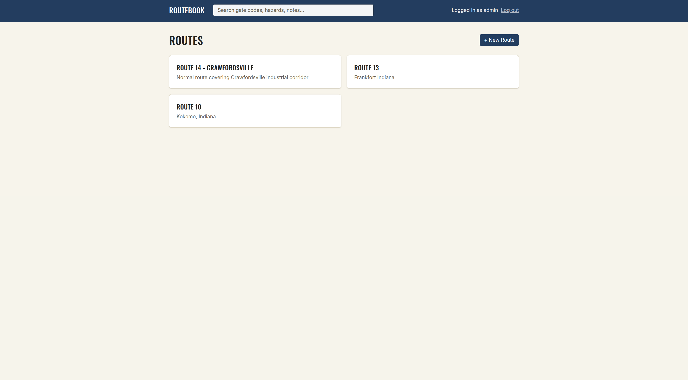

# RouteBook


**Live app**: https://routebook-frontend.onrender.com
**Live API**: https://routebook-da3w.onrender.com/api/drivers

Both hosted on Render's free tier — services spin down after 15 minutes of inactivity, so the first request after idle time may take 30-60 seconds to wake up.



RouteBook is an institutional-knowledge management system for Cintas Service Sales Representative (SSR) routes — a digital replacement for the sticky notes, texts, and tribal knowledge that carry gate codes, dock hazards, parking rules, and access instructions between drivers when a route changes hands.

## The problem

When an SSR route gets reassigned, the knowledge that made the outgoing driver efficient — "the gate code resets monthly," "don't park in front of the dock doors," "ask for Mike at the front desk" — usually doesn't transfer with it. RouteBook gives that knowledge a permanent, searchable home, attached directly to the route or the specific stop it applies to.

## Tech stack

- **Backend**: Spring Boot 3.5.16, Java 21 (target), Spring Data JPA, Spring Security (OAuth2 resource server), Bean Validation
- **Database**: PostgreSQL in production; H2 (in-memory) for local development and tests
- **File storage**: Cloudflare R2 (S3-compatible) via AWS SDK v2, for attachment photos/PDFs/documents/videos
- **Build**: Maven, containerized with Docker for deployment
- **CI**: GitHub Actions, running the full test suite on every push and PR

Companion frontend: [routebook-frontend](https://github.com/SethSorrellDev/routebook-frontend) (React 19 + TypeScript + Vite + Tailwind CSS v4).

## Core features

- **Route/Stop/Driver/Location model** — mirrors real SSR route structure
- **Knowledge entries with exactly one target** — every note attaches to either a Route or a Stop, never both, never neither (enforced at the service layer, with an entity-level backstop)
- **Full CRUD** — create, edit, and delete for routes, stops, and knowledge entries, with correct cascading cleanup (deleting a route removes its stops and every associated knowledge entry and attachment; deleting a stop or entry cleans up its own attachments, both the R2 object and the database row)
- **Atomic writes** — creating a stop (which requires a new Location) happens in a single `@Transactional` operation, so a failure partway through can never leave orphaned data
- **File attachments** — photos, PDFs, Word docs, plain text, spreadsheets, and videos, stored in Cloudflare R2, served via time-limited presigned URLs. Verified end-to-end against a live bucket, including real uploads through the live app.
- **Real server-side search** — a database-level, case-insensitive query on title/body text, not a fetch-everything-and-filter approach
- **Authentication** — public read access for browsing; every write requires a valid access token from a shared identity service (RS256, verified against its public JWKS), and RouteBook decides which users may write from its own allowlist. RouteBook holds no passwords and no signing keys.
- **Structured error handling** — every API error returns a consistent `{status, message, timestamp, fieldErrors}` shape
- **Content-type and size validation** — 25MB cap for photos/documents, 250MB for videos, with an explicit content-type whitelist

## Authentication and configuration

Sign-in is handled by a separate identity service that also backs my other portfolio apps. RouteBook only verifies the tokens it issues: signature, issuer, expiry, and that the token is an access token rather than a refresh token. Reads are public. Writes (POST/PUT/DELETE) need `ROLE_ADMIN`, which a user gets only when their token `sub` is listed in `ADMIN_SUBJECTS`. If that list is empty, nobody can write.

| Variable | Purpose | Default |
|---|---|---|
| `IDENTITY_JWKS_URI` | Where to fetch the identity service's public keys | `http://localhost:8081/.well-known/jwks.json` |
| `IDENTITY_ISSUER` | Expected token issuer | `identity-service` |
| `ADMIN_SUBJECTS` | Comma-separated user IDs allowed to write | empty |

The identity service runs on a free Render instance that sleeps when idle, so the first sign-in after a quiet period can take a minute.

## Documentation

- [SETUP.md](SETUP.md) — getting the backend running locally, environment variables, testing
- [ARCHITECTURE.md](ARCHITECTURE.md) — layered design, domain model, key decisions
- [API_REFERENCE.md](API_REFERENCE.md) — full endpoint reference with examples

## Testing

35 tests: unit tests for the Route/Stop XOR business rule and file upload validation (with mocked R2 calls — no network access needed), plus integration tests exercising the full API surface — happy paths, 404s, validation errors, authentication enforcement, and cascade-delete behavior — against a real Spring context and test H2 database. Runs automatically in CI on every push.

```bash
./mvnw test
```

## Deployment

Deployed on Render: the backend as a Dockerized web service connected to a managed PostgreSQL instance, the frontend as a separate static site. See [SETUP.md](SETUP.md) for local setup and environment variable configuration.

## Known limitations

- **Single admin account, no multi-user management** — an intentional design choice. This app has one operator (an SSR or a small team), not a multi-tenant user base, so a full user/role system would be over-engineering for the actual use case.
- **Split-repo structure** (backend and frontend as separate GitHub repos, rather than a monorepo) — a deliberate choice to mirror independent deployment (they're deployed as two separate Render services, versioned and released independently), at the cost of cross-repo documentation links needing full URLs instead of relative paths, and slightly more overhead keeping both repos' CI/docs in sync.
- **Free-tier hosting** — cold starts after inactivity, and the free Postgres instance has a periodic renewal requirement.
